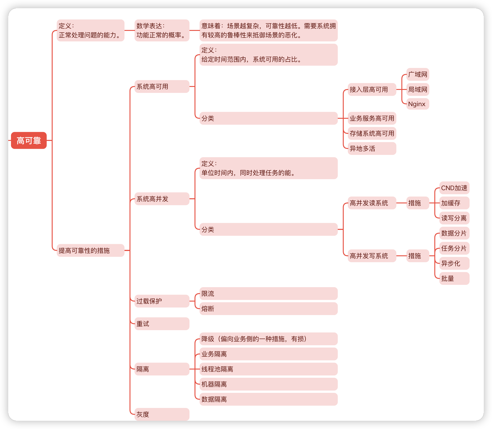

### A

[124. 二叉树中的最大路径和](https://leetcode.cn/problems/binary-tree-maximum-path-sum/)

```go
/**
 * Definition for a binary tree node.
 * type TreeNode struct {
 *     Val int
 *     Left *TreeNode
 *     Right *TreeNode
 * }
 */
func maxPathSum(root *TreeNode) int {
    maxSum := math.MinInt32
    dfs(root, &maxSum)

    return maxSum
}

func dfs(root *TreeNode, maxSum *int) int {
    if root == nil {
        return 0
    }

    tempSum,maxSubPathSum := root.Val, root.Val

    maxLeftNodeSum :=  dfs(root.Left, maxSum)
    if maxLeftNodeSum > 0 {
        tempSum += maxLeftNodeSum
    }
    maxRightNodeSum := dfs(root.Right, maxSum)
    if maxRightNodeSum > 0 {
        tempSum += maxRightNodeSum
    }

    if *maxSum < tempSum {
        *maxSum = tempSum
    }

    maxSubPathSum += max(0, max(maxLeftNodeSum, maxRightNodeSum))

    return maxSubPathSum
}

func max(a, b int) int {
    if a > b {
        return a
    }

    return b
}
```


### R

最近在看《Observability Engineering》英文原著，在这部分我们简单聊下“The Mathematical Definition of Observability” 和 “Applying Observability to Software Systems”。

学过《现代控制理论》的同学应该对能观性有基本的认识。能观性与能控性在1960年被卡尔曼提出，它是最优控制和最优估计的设计基础。在控制理论中，能观性的数学含义如下：如果对于任意给定的输入u，在有限的观测时间范围内[t0,tf]期间输出y(t)能唯一地确定系统在t0时刻的状态，则称t0时的系统状态能观测，若系统的每一个状态都是能观测的，则称系统是状态完全能观测的，简称能观的。

如何将能观性应用到软件系统呢？我们可从以下几个问题着手：

1. 理解应用的内部运作。
2. 了解应用程序可能会进入的任何系统状态，即使是从未见过并的状态。
3. 使用外部工具来观察和查询了解系统的内部状态。
4. 理解内部状态而无需发布任何新的自定义代码来处理它(需要事先了解它)。


### T

Vagrant作为一款管理虚拟机工具，能够帮助开发者快速搭建和管理自己的开发环境。
[安装手册-Apple M2](https://zengjunwen.github.io/blog/%E5%AE%89%E8%A3%85%E5%92%8C%E4%BD%BF%E7%94%A8Vagrant)

### S

今天讲一些和系统设计相关的一些东西，后面也会写一系列系统设计的文章。系统设计，从宏观角度来讲，有一套成熟的方法论，大家应该都知道，这套方法论叫系
统工程，当然，我们不会从系统工程这么专业的角度来聊系统设计，相反，我想结合工作中最长遇到的问题来聊一些和系统设计相关的东西。

在软件开发领域，对业务而言，提供一个高可靠的系统至关重要。如何衡量系统的可靠性？通过查询相关文献，很少有一个严格的标准来定义软件系统的稳定性。反而
从理论的角度来，通过抽象的数学公式来定义系统的可靠性，在很多论文里都能查到。对于软件系统，我认为如下定义系统的可靠性，可能更通俗易懂：“软件系统的可靠
性表示系统正常处理任务的概率”。系统正常运行的概率越高，系统越可靠。当然这个说法并不是没有问题。采用什么手段计算系统的可靠性是很值得讨论的一个问题。在
不同场景下，系统正常处理任务的概率可能是不同的。我们需要考虑不同场景来衡量系统的可靠性。根据这些理解，我们很容理解为什么系统要设计时，要考虑以下问题了：
1. 高并发，保证在 请求量剧增时，系统依然正常运行。
2. 高可用，不因为某些服务节点挂了，导致系统不可用。
3. 过载保护，不因出乎意料的流量导致服务不可用。
4. 隔离，防止问题在系统扩散。
5. 灰度，新功能逐渐上线。

好了，今天就聊到这里。后续我们聊一聊系统的可观测性和可维护性。


