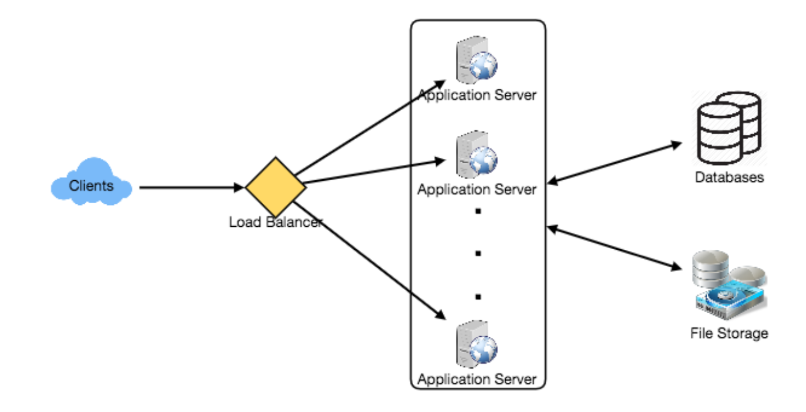

### A

doing

### R

最近在阅读系统设计的英文版，具体的内容我们在S部分进行分享。

### T
最近准备出行，需要购买8张机票，为了剩些钱，需要时刻关注机票的价格变化，每次手动查票都很麻烦。 了解了下python的selenium库，能够省去一些操作。
下面简单演示下安装和操作方法。

#### 安装chromedriver

法一：

```bash
$ brew install chromedriver
$ chromedriver --version
ChromeDriver 116.0.5845.96 (1a391816688002153ef791ffe60d9e899a71a037-refs/branch-heads/5845@{#1382})
```

法二：

从 https://googlechromelabs.github.io/chrome-for-testing/ 下载chromedrive

将可执行文件放入到`/usr/local/bin`

#### 安装对应版本的Chrom

版本尽量一致。https://googlechromelabs.github.io/chrome-for-testing/

#### 运行

```python
import time
from selenium import webdriver
from selenium.webdriver.common.keys import Keys
# 启动浏览器
chrome_options = webdriver.ChromeOptions()
chrome_options.add_argument("--user-agent=Mozilla/5.0 (Windows NT 10.0; Win64; x64) AppleWebKit/537.36 (KHTML, like Gecko) Chrome/92.0.4515.131 Safari/537.36")

driver = webdriver.Chrome("/opt/homebrew/bin/chromedriver",options=chrome_options)  # 需要安装 Chrome 浏览器和对应的 ChromeDriver
driver.get("https://www.csair.com/cn/")  # 替换为你要爬取的机票网站 URL
time.sleep(1)

# 定位并填写出发地和目的地
departure_input = driver.find_element_by_id("fDepCity")  # 根据实际网页的元素 ID 进行定位
departure_input.clear()  # 清空输入框内容
departure_input.send_keys("郑州")  # 填入出发地
time.sleep(1)

destination_input = driver.find_element_by_id("fArrCity")  # 根据实际网页的元素 ID 进行定位
destination_input.clear()  # 清空输入框内容
destination_input.send_keys("贵阳")  # 填入目的地
time.sleep(1)

# 选择出发时间
date_script = '''
var departure_time_input = document.getElementById("fDepDate");  // 根据实际网页的元素 ID 进行定位
departure_time_input.removeAttribute("readonly");  // 移除 readonly 属性
departure_time_input.value = "2023-09-18";  // 设置日期，替换为你想选择的日期
'''
driver.execute_script(date_script)
time.sleep(1)

# 定位并点击"立即查询"按钮
search_button = driver.find_element_by_class_name("searchBtn")  # 根据按钮的类名进行定位
search_button.click()  # 点击按钮
```


### S

如何进行系统分析设计？

#### Step 1 需求澄清

尽可能的了解需要解决的问题边界。系统设计是一个开放式问题，没有一个标准答案，所以在进行系统设计前，我们要搞清楚那些模凌两可的问题。

#### Step 2 接口定义

定义系统需要提供的接口。这不仅将建立系统所期望的确切合同，而且还将确保我们没有得到任何错误的需求。

#### Step 3 粗略的评估

初期，粗略考虑系统的扩展性是必不可少的，有助于在未来聚焦分区、负载均衡和缓存等设计。这里可以先考虑以下几个部分：
* 系统大概需要多少存储
* 系统的请求量是多少？需要的带宽大概是多少。

#### Step 4 定义数据模型

定义数据模型能够清晰的表达数据在系统的不同组建之间是如何流动的，同时也是我们进行数据分区的基础。

#### Step 5 高层次的设计

从宏观角度画一个各模块的框图，大概如下：



#### Step 6 详细设计

深入每个模块进行详细设计，对于不同场景有不同的设计方法，阐述每种方案的优缺点。

#### Step 7 识别并解决系统瓶颈

例如：

1. 系统是否有单点故障？
2. 数据是否需要副本？
3. 如何监控系统的性能？
