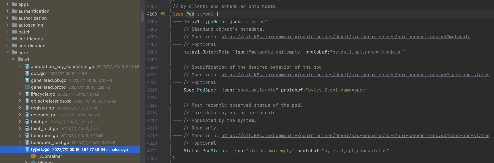
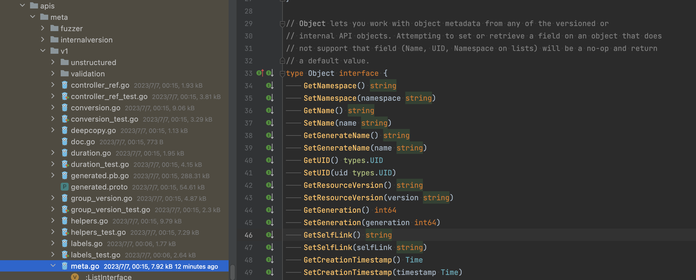

在 Kubernets 中，对象能够表示集群的运行状态，代表着集群中运行的容器化应用及占用的资源和行为。本文将简单介绍下对象的数据结构。

先来看一下 Kubernets 的一个描述文件的部分内容：
<!--truncate-->
```yaml
apiVersion: v1
kind: Pod
metadata:
  name: nginx
  labels:
    name: nginx
spec:
  # ...
```

其中apiVersion、kind和metadata在每个对象中都有。其中apiVersion和kind共同确定了该YAML配置文件应该创建的对象类型。这里表示为创建核心API中api/vi中的Pod对象。



而metadata为我们提供了识别唯一对象的信息，包括了虚拟集群的name和用于组织、分类的labels。

## 对象

Kubernets 中的对象都实现了一个叫 Object 的接口，接口部分内容如下：



这些接口定义主要是用来获取具体对象中嵌套的 ObjectMeta 中的属性值，以Pod为例，其数据结构如下：


其中 metav1.TypeMeta 保存了我们定义的对象的 apiVersion 和 kind，metav1.ObjectMeta 保存了我们定义的metadata，Spec 保存了我们定义的Spec，而 Status 记录了当前对象的运行状态。

 Kubernetes 的控制器会不断获取集群中对象的运行状态，保证对象像期望的状态迁移。
