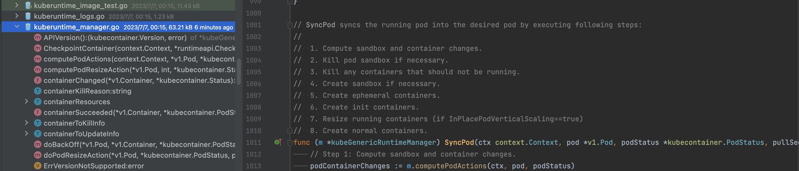

Pod中托管了一个或多个容器。从“规格”的角度来看，Pod介于容器和VM之间——它比容器大，又远小于VM。在 Kubernets 的世界中，Pod 是进行服务部署的基本单位，Pod 部署操作是一个原子操作，即“要么全部成功，要么什么都不做”（all-or-nothing）。
<!--truncate-->

Pod 的创建通过 kubelet 调用SyncPod来实现，主要为以下6步：

```
 1. Compute sandbox and container changes.
 2. Kill pod sandbox if necessary.
 3. Kill any containers that should not be running.
 4. Create sandbox if necessary.
 5. Create ephemeral containers.
 6. Create init containers.
 7. Resize running containers (if InPlacePodVerticalScaling==true)
 8. Create normal containers.
```



以下是对每个步骤功能的解释：

1. 计算沙箱和容器的更改：该步骤用于计算Pod沙箱和容器的更改。它可能包括添加、删除或更新容器以及其他相关的配置更改。
2. 如果需要，终止Pod沙箱：在此步骤中，如果存在旧的Pod沙箱，且需要进行更改或重新创建，则会终止该旧沙箱。
3. 终止不应运行的任何容器：在这一步中，终止那些不应该继续运行的容器。可能是因为它们已经过时或配置有误。
4. 如有必要，创建沙箱：如果没有有效的Pod沙箱存在，此步骤将创建一个新的Pod沙箱。沙箱是运行Pod的隔离环境。
5. 创建临时容器：在此步骤中，创建临时容器。这些容器通常是用于临时任务或特定操作的短暂性容器。
6. 创建初始化容器：如果Pod定义中定义了初始化容器，此步骤将根据定义创建并运行初始化容器。初始化容器在主容器之前运行，用于完成一些预备工作或设置特定环境。
7. 调整正在运行的容器大小（如果 InPlacePodVerticalScaling==true）：如果启用了InPlacePodVerticalScaling且有需要调整大小的正在运行的容器，此步骤将根据需要调整这些容器的大小。
8. 创建普通容器：在此步骤中，创建并运行主要的普通容器。这些容器是Pod中的核心容器，负责运行应用程序或服务。