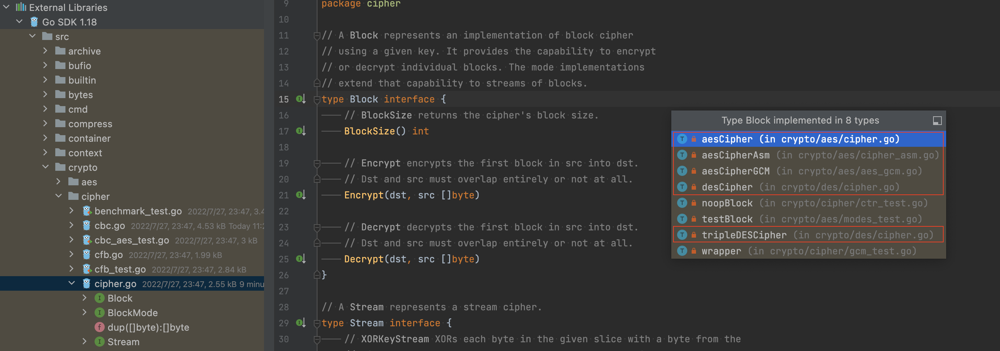
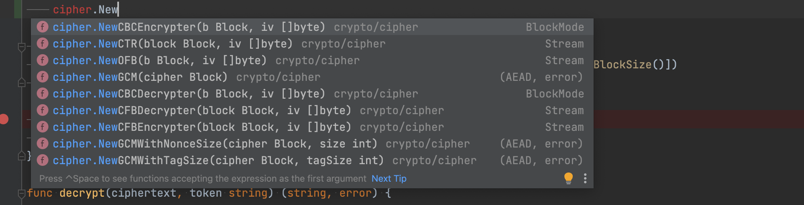

对称密码算法可以分为分组密码和流密码两种 。

<!--truncate-->

## 分组密码

分组密码 (block cipher) 是每次只能处理特定长度的一块数据 的一类密码算法，这里的 “一块”就称为分组 (block)。 此外，一个分组的比特数就称为分组长度 (blocklength)。

 DES 和三重 DES 的分组长度都是 64 比特。 这些密码算法一次只能加密 64 比特的明 文，并生成 64 比特的密文 。

AES的分组长度为 128比特，因此AES一次可加密 128比特的明文，并生成 128比特的 密文。

## 流密码

流密码 (stream cipher) 是是一种逐位或逐字节加密的密码算法。它以密钥为输入，并根据密钥生成一个无限长的伪随机密钥流（keystream）。将明文与伪随机密钥流进行按位异或运算，从而实现加密和解密过程。由于流密码逐位操作，因此适合于对连续数据流进行实时加密，例如通信中的数据传输。

分组密码处理完 一个分组就结束了，因此不需要通过内部状态来记录加密的进度;相对地， 流密码是对一 串数据流进行连续处理，因此需要保持内部状态 。**分组密码和流密码并非相互对立的，流密码可以使用分组密码来实现。一种常见的做法是将分组密码模式（例如CTR模式或OFB模式）与AES结合使用，以将AES转化为适用于连续数据流的流密码。这些模式利用AES的加密功能生成一个伪随机密钥流（keystream），然后将明文与伪随机密钥流进行按位异或运算来实现加密。**

## Go对称加密源代码

在 Go 的cipher包中定义了三个接口：

```go
type Block interface {
   BlockSize() int
   Encrypt(dst, src []byte)
   Decrypt(dst, src []byte)
}

type Stream interface {
   XORKeyStream(dst, src []byte)
}

type BlockMode interface {
   BlockSize() int
   CryptBlocks(dst, src []byte)
}
```

Block 为分组加密，Stream 为流加密，BlockMode表示块加密的模式。我们着重看下分组加密，因为在工作中使用得相对较多。



可以看到，Block 分别由aesCipher、aesCipherAsm、aesCipherGCM、desCipher 和tripleDESCipher实现。

aesCipher：为 go 实现的对称加密。
aesCipherAsm：为支持ASM指令集的对称加密。
aesaesCipherGCM：为支持ASM指令集的GCM。
desCipher和tripleDESCipher：DES 和三重 DES。

### Block 的 Encrypt 方法和 Decrypt 方法

Encrypt 和 Decrypt 调用一次只能对一个 block 进行加密或解密。当需要加密的明文或需要解密的密文远大于 block size 时，需要调用多次。对于支持并行加解密的模式，我们可以同步并行调用 Encrypt 和 Decrypt 实现。

在 BlockMode 的实现中，CryptBlocks 方法对Encrypt、Decrypt进行包装，从而不需要进行加解密的多次调用，但由于实现均为串行，对于支持并行的模式性能会有所下降。

Go 语言中，使用 `aes.NewCipher(tokenBytes)` 创建 block。下面我们来看下如何对已创建的 block 指定加密模式。

## 加密模式

Go 语言中的 cipher 包提供了一些列的方法针对 block 指定我们想要的加密模式：



**其中没有 ECB 模式，因为最基本的 Block 接口实现就已经是 ECB 模式了。**

各模式的 prons and cons 如下：

| Mode                  | Acronym | Advantages                                                   | Disadvantages                                                | Recommendation              |
| --------------------- | ------- | ------------------------------------------------------------ | ------------------------------------------------------------ | --------------------------- |
| Electronic CodeBook   | ECB     | Simple, fast, supports parallel encryption/decryption        | Plaintext repetition is reflected in ciphertext, not recommended for use, ciphertext can be manipulated by deleting/replacing blocks | Not recommended by CRYPTREC |
| Cipher Block Chaining | CBC     | Supports parallel decryption, can decrypt any ciphertext block, no need for padding | Plaintext repetition is reflected in ciphertext, vulnerable to replay attacks, ciphertext block with some bit errors may affect corresponding plaintext block | Recommended by CRYPTREC     |
| Cipher Feedback       | CFB     | Supports parallel decryption, can decrypt any ciphertext block, no need for padding | Plaintext repetition is reflected in ciphertext, vulnerable to replay attacks, ciphertext block with some bit errors may affect corresponding plaintext block | Recommended by CRYPTREC     |
| Output Feedback       | OFB     | Supports parallel decryption, can decrypt any ciphertext block, no need for padding | Plaintext repetition is reflected in ciphertext, vulnerable to replay attacks, ciphertext block with some bit errors may affect corresponding plaintext block | Recommended by CRYPTREC     |
| Counter               | CTR     | Supports parallel encryption/decryption, can decrypt any ciphertext block, no need for padding | Plaintext repetition is reflected in ciphertext, vulnerable to replay attacks, ciphertext block with some bit errors may affect corresponding plaintext block | Recommended by CRYPTREC     |

其中 OFB 和 CTR 为流密码模式。

各算法的代码实现可以参考：http://liuqh.icu/2021/06/19/go/package/16-aes/